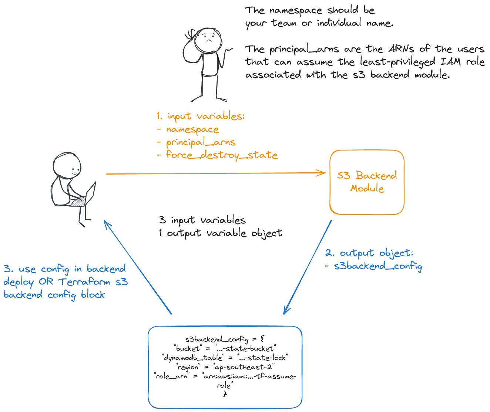

# Production-ready S3 Backend Module

The S3 backend module works as follows. State files are encrypted at rest using KMS. Access is controlled by a least-privileged IAM policy, and everything is synchronised with DynamoDB.

The S3 backend module contains shared state and is used by developers to manage shared infrastructure using 
an *initialized* local workspace.

A workspace needs the following variables defined in order to initialize and deploy against an S3 backend:

- Name of the S3 bucket
- Region the backend was deployed to
- Amazon Resource Name (ARN) of the role that can be assumed
- Name of the DynamoDB table

In this module we follow the [Standard Module Structure](https://developer.hashicorp.com/terraform/language/modules/develop/structure).

## References

The following key references were leveraged in this work.

The first one is the key reference that I used and I've updated the publically available [S3 Backend Module source](https://github.com/terraform-in-action/manning-code/tree/master/chapter6) to use the latest provider versions (amongst other adaptations).

- [Terraform in Action, Chapter 6, Scott Winkler](https://www.manning.com/books/terraform-in-action) *I highly recommend buying a copy of this book.* 
- [Hashicorp S3 Backend Online Documentation](https://developer.hashicorp.com/terraform/language/settings/backends/s3)

## Basic Setup Instructions

You should use the [published module](https://registry.terraform.io/modules/nicodewet/s3backend/aws/latest) in another Terraform project, 
e.g. named *s3backend_deploy*.

As you would expect by convention the input variables are in the file *variables.tf*

You need to specify the **namespace** which should be your team name, or some other appropriate team name. Do not use the default value. The notion of team is mentioned because a key purpose of the S3 Backend Module is to share state between people. But it could also just be your personal state, in that case perhaps use your name (nico in my case) or company name (thorgil in my case).

Next you'll need to specify **principal_arns** and also the **force_destroy_state** which is true by default.

I've added an **Extensive Setup Instructions** section with references to exercises in the *exercises* folder as a means of remembering how 
to get going with the S3 Backend Module. Note [Terraform in Action, Chapter 6, Scott Winkler](https://www.manning.com/books/terraform-in-action) is the authoritative guide, these are my personal notes.

## S3 Backend Module Overview


The S3 backend module has 3 input variables and one output variable. The output variable *config* contains the configuration for a workspace to initialise itself against the S3 backend.

## S3 Backend Module Input and Output Variables



Four distinct components comprise the S3 backend module:

- DynamoDB table - For state locking.
- S3 bucket and Key Management Service (KMS) key - For state storage and encryption at rest.
- Identity and Access Management (IAM) least-privileged role - So other AWS accounts can assume a role to this account and perform deployments against the S3 backend.
- Miscellaneous housekeeping resources.

The following diagram shows the four distinct components that make up the S3 Backend Module.

## S3 Backend Module Detailed Component Diagram


Because there is no dependency relationship between the modules, and so no resource hierarchy, and also because we have a small-to-medium sized cobebase a *flat module* can be used to organize the Terraform code. The advantage of the flat module,
rather than nested modules, is not needing to link modules together.

## S3 Backend Module is a Flat Module

Rather than using a nested module structure we've opted for a flat module structure.


## Extensive Setup Instructions

This is a run through the exercises which I've adapted to suit my needs (e.g. using AWS regions in Asia Pacific).

### Terraform Registry Setup

This simply entailed following the [public module Terraform Registry publication requirements](https://developer.hashicorp.com/terraform/registry/modules/publish).

Once these requirements have been met [semantically versioned GitHub release tags automatically result in Terraform Registry module publication](https://developer.hashicorp.com/terraform/registry/modules/publish).

### s3backend_deploy

Resources have two tags:

- The first has Key **ResourceGroup** which is used by Terraform and has randomisation built into the value (see main.tf in the S3 Backend Module).
- The second has Key **Name** has the fixed value **terraform-s3backend-component** and is to populate this field in the AWS Console UI.

Now for the S3 Backend Configuration. 

Note the **priincipal_arns** variable has not been specified because as per the S3 Backend Module's **iam.tf** it will default to the AWS
caller identity's ARN, so your ARN, *which is good to start with*.

The ominoulsy named **force_destroy_state** variable hasn't been specified either as it only [applies when the bucket is destroyed](https://registry.terraform.io/providers/hashicorp/aws/latest/docs/resources/s3_bucket#force_destroy).

```
s3backend_module/exercises/s3backend_deploy  (git)-[main]- % cat s3backend.tf 

provider "aws" {
    region  = "ap-southeast-2"
}

module "s3backend" {
    source      = "nicodewet/s3backend/aws"
    version     = "0.6.0"
    namespace   = "team-nico"
}

output "s3backend_config" {
    // config required to connect to the backend
    value = module.s3backend.config
}
```

Now let's deploy so we can start using it. 

I'm intentionally not using the *auto-approve* option along with the *apply* command as I feel it's important to pause
and study the output, even when one is very familiar with what the module does. 

```
s3backend_module/exercises/s3backend_deploy  (git)-[main]- % terraform init && terraform apply
```

In terms of the output, here is an example with identifiers scrambled. 

In the next step, namely s3backend_test, we'll abstracting sensitive ARNs and this means using placeholders 
or environment variables instead of hardcoding them.

```
s3backend_config = {
  "bucket" = "team-nico-g502k751zdtty1-state-bucket"
  "dynamodb_table" = "team-nico-g502k751zdtty1-state-lock"
  "region" = "ap-southeast-2"
  "role_arn" = "arn:aws:iam::111111111111:role/team-nico-g502k751zdtty1-tf-assume-role"
}
```

### s3backend_test

Firstly inspect test.tf and notice the variables in the s3 backend declaration section which we'll populate using environment variables 
and command line flags.

```
s3backend_module/exercises/s3backend_test % export ROLE_ARN='arn:aws:iam::111111111111:role/team-nico-g502k751zdtty1-tf-assume-role'
s3backend_module/exercises/s3backend_test % export DYNAMODB_TABLE='dynamodb_table=team-nico-g502k751zdtty1-state-lock'
s3backend_module/exercises/s3backend_test % export REGION='ap-southeast-2'
s3backend_module/exercises/s3backend_test % export BUCKET='team-nico-g502k751zdtty1-state-bucket'
s3backend_module/exercises/s3backend_test % terraform init \                                                                        
  -backend-config="bucket=$BUCKET" \
  -backend-config="dynamodb_table=$DYNAMODB_TABLE" \
  -backend-config="region=$REGION" \
  -backend-config="role_arn=$ROLE_ARN"
```

### s3backend_with_workspaces

TODO

## Future Work

### What about a continuous build and deploy pipeline for this very S3 Backend Module?

**This is planned as future work.**

It is important to have a periodic, say daily (even without commits), build and deploy of this module.

Implementing CI/CD, say using GitHub Actions, will proactively ensure that this module remains stable and 
functional over time.

In a generic sense, doing so offer the following benefits:

- **Automated Testing**: Every time you or someone else makes changes to the module, you can automatically run 
tests (e.g., terraform validate, terraform plan) to ensure no regressions or issues are introduced.

- **Versioning Control**: You can automate the process of version tagging and releasing new versions to the Terraform 
registry, ensuring consistent version management.

- **Early Detection**: If dependencies or underlying services change, tests will catch those issues before they impact users.

- **Confidence for Public Users**: As it's publicly available, external users will have more confidence in a module that is 
rigorously tested and maintained.