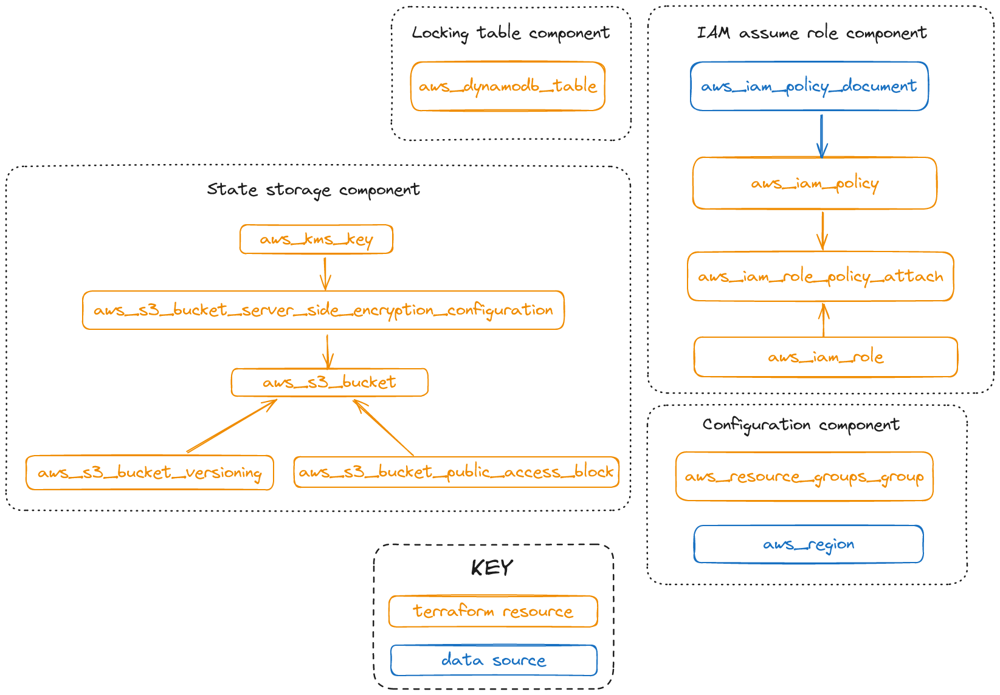

# Production-ready S3 Backend Module

The S3 backend module works as follows. State files are encrypted at rest using KMS. Access is controlled by a least-privileged IAM policy, and everything is synchronised with DynamoDB.

The S3 backend module contains shared state and is used by developers to manage shared infrastructure using 
an *initialized* local workspace.

A workspace needs the following variables defined in order to initialize and deploy against an S3 backend:

- Name of the S3 bucket
- Region the backend was deployed to
- Amazon Resource Name (ARN) of the role that can be assumed
- Name of the DynamoDB table

In this module we follow the [Standard Module Structure](https://developer.hashicorp.com/terraform/language/modules/develop/structure).

## References

The following key references were leveraged in this work.

- [Terraform in Action, Chapter 6, Scott Winkler](https://www.manning.com/books/terraform-in-action) *I highly recommend buying a copy of this book.* 
- [Hashicorp S3 Backend Online Documentation](https://developer.hashicorp.com/terraform/language/settings/backends/s3)

## Setup Instructions

You should use the published module in another Terraform project, e.g. named *s3backend_deploy*.

As you would expect by convention the input variables are in the file *variables.tf*

You need to specify the **namespace** which should be your team name, or some other appropriate team name. Do not use the default value. The notion of team is mentioned because a key purpose of the S3 Backend Module is to share state between people. But it could also just be your personal state, in that case perhaps use your name (nico in my case) or company name (thorgil in my case).

Next you'll need to specify **principal_arns** and also the **force_destroy_state** which is true by default.

## S3 Backend Module Overview

The S3 backend module has 3 input variables and one output variable. The output variable *config* contains the configuration for a workspace to initialise itself against the S3 backend.

## S3 Backend Module Input and Output Variables

Four distinct components comprise the S3 backend module:

- DynamoDB table - For state locking.
- S3 bucket and Key Management Service (KMS) key - For state storage and encryption at rest.
- Identity and Access Management (IAM) least-privileged role - So other AWS accounts can assume a role to this account and perform deployments against the S3 backend.
- Miscellaneous housekeeping resources.

The following diagram shows the four distinct components that make up the S3 Backend Module.

## S3 Backend Module Architecture Diagram

Because there is no dependency relationship between the modules, and so no resource hierarchy, and also because we have a small-to-medium sized cobebase a *flat module* can be used to organize the Terraform code. The advantage of the flat module,
rather than nested modules, is not needing to link modules together.

## S3 Backend Module is a Flat Module

Rather than using a nested module structure we've opted for a flat module structure.

