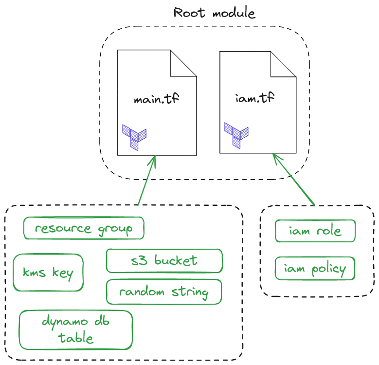

# Production-ready S3 Backend Module

The S3 backend module works as follows. State files are encrypted at rest using KMS. Access is controlled by a least-privileged IAM policy, and everything is synchronised with DynamoDB.

The S3 backend module contains shared state and is used by developers to manage shared infrastructure using 
an *initialized* local workspace.

A workspace needs the following variables defined in order to initialize and deploy against an S3 backend:

- Name of the S3 bucket
- Region the backend was deployed to
- Amazon Resource Name (ARN) of the role that can be assumed
- Name of the DynamoDB table

## S3 Backend Module Overview

The S3 backend module has 3 input variables and one output variable. The output variable *config* contains the configuration for a workspace to initialise itself against the S3 backend.

## S3 Backend Module Input and Output Variables

Four distinct components comprise the S3 backend module:

- DynamoDB table - For state locking.
- S3 bucket and Key Management Service (KMS) key - For state storage and encryption at rest.
- Identity and Access Management (IAM) least-privileged role - So other AWS accounts can assume a role to this account and perform deployments against the S3 backend.
- Miscellaneous housekeeping resources.

The following diagram shows the four distinct components that make up the S3 Backend Module.

## S3 Backend Module Architecture Diagram

Because there is no dependency relationship between the modules, and so no resource hierarchy, and also because we have a small-to-medium sized cobebase a *flat module* can be used to organize the Terraform code. The advantage of the flat module,
rather than nested modules, is not needing to link modules together.

## S3 Backend Module is a Flat Module

Rather than using a nested module structure we've opted for a flat module structure.

